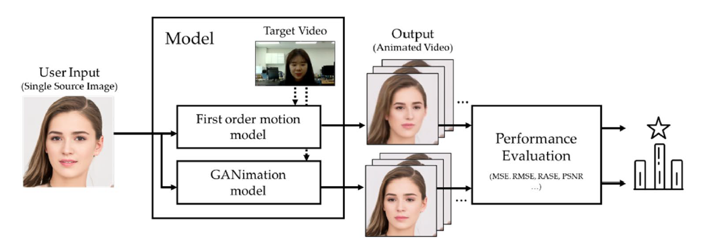

# An experimental study of animating‑based facial image manipulation in online class environments

[Paper](https://www.nature.com/articles/s41598-023-31408-y)

by
**Jeong-Ha Park**, 
Chae-Yun Lim, and Hyuk-Yoon Kwon*


This paper has been submitted for publication in Scientific Reports (publisher: Springer Nature), Vol. 10, Article No. 4667, pp. 1-12, Mar. 2023 (Impact Factor:  4.996, Top 25%).




*Proposed framework for performance evaluation of animating-based expression swap.*


## Abstract

> Recent advances in artificial intelligence technology have significantly improved facial image
manipulation, which is known as Deepfake. Facial image manipulation synthesizes or replaces a region
of the face in an image with that of another face. The techniques for facial image manipulation are
classified into four categories: (1) entire face synthesis, (2) identity swap, (3) attribute manipulation,
and (4) expression swap. Out of them, we focus on expression swap because it effectively manipulates
only the expression of the face in the images or videos without creating or replacing the entire face,
having advantages for the real-time application. In this study, we propose an evaluation framework
of the expression swap models targeting the real-time online class environments. For this, we
define three kinds of scenarios according to the portion of the face in the entire image considering
actual online class situations: (1) attendance check (Scenario 1), (2) presentation (Scenario 2), and
(3) examination (Scenario 3). Considering the manipulation on the online class environments, the
framework receives a single source image and a target video and generates the video that manipulates
a face of the target video to that in the source image. To this end, we select two models that satisfy
the conditions required by the framework: (1) first order model and (2) GANimation. We implement
these models in the framework and evaluate their performance for the defined scenarios. Through
the quantitative and qualitative evaluation, we observe distinguishing properties of the used two
models. Specifically, both models show acceptable results in Scenario 1, where the face occupies a
large portion of the image. However, their performances are significantly degraded in Scenarios 2
and 3, where the face occupies less portion of the image; the first order model causes relatively
less loss of image quality than GANimation in the result of the quantitative evaluation. In contrast,
GANimation has the advantages of representing facial expression changes compared to the first order
model. Finally, we devise an architecture for applying the expression swap model to the online video
conferencing application in real-time. In particular, by applying the expression swap model to widely
used online meeting platforms such as Zoom, Google Meet, and Microsoft Teams, we demonstrate its
feasibility for real-time online classes.


## Software implementation


The source codes for the two models covered in this paper are in the `GANimation-master` and `faceit_live3` folders, respectively.

For a detailed description of running the model, see the original GitHub repository.

1. [GANimation](https://github.com/albertpumarola/GANimation)

2. [faceit_live3](https://github.com/alew3/faceit_live3)


Any image including the face area can be used as input data.

## Getting the code

You can download a copy of all the files in this repository by cloning the
[git](https://git-scm.com/) repository:

    https://github.com/parkjungha/Capstone_2021_deepfine.git

or download a zip archive.


## Dependencies

We use AWS EC2 p2.8xlarge instance equipped with Nvidia Tesla K80 with 12GB memory.

You'll need a working Python environment to run the code.
The recommended way to set up your environment is through the
[Anaconda Python distribution](https://www.anaconda.com/download/) which
provides the `conda` package manager.
Anaconda can be installed in your user directory and does not interfere with
the system Python installation.


The required dependencies are specified in the file `GANimation-master/requirements.txt`, and `faceit_live3/first-order-model/requirements.txt`, for each model. 

We use `conda` virtual environments to manage the project dependencies in
isolation.
Thus, you can install our dependencies without causing conflicts with your
setup (even with different Python versions).


## Reproducing the results

Since the two models operate independently, we recommend using two anaconda virtual environments to avoid some conflicts.
Before running any code you must activate appropriate conda environment.

To train a GANimation model, on specific dataset run:

    bash launch/run_train.sh


To train a first-order model, on specific dataset run:

    CUDA_VISIBLE_DEVICES=0,1,2,3 python run.py config/dataset_name.yaml --device_ids 0,1,2,3


## Citation
If you use this code or ideas from the paper for your research, please cite our paper:
```
@article{park2023experimental,
  title={An experimental study of animating-based facial image manipulation in online class environments},
  author={Park, Jeong-Ha and Lim, Chae-Yun and Kwon, Hyuk-Yoon},
  journal={Scientific Reports},
  volume={13},
  number={1},
  pages={4667},
  year={2023},
  publisher={Nature Publishing Group UK London}
}```
